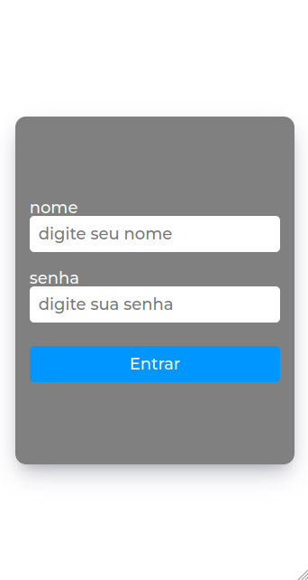
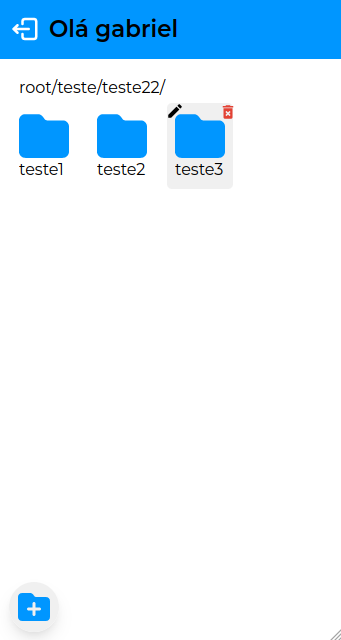

# Levo um casaquinho?

Aplicação de front-end para o desafio técnico da vaga de front-end react júnior da 7Dev. Nesta aplicação, é possível logar, criar pastas, subpastas, navegar, renomeá-las e trocar seu diretório pai.

<div style="display: flex; width: 100%; gap: 2%;">
  
  
</div>

## Deploy

<a href="https://folder-manager-pink.vercel.app">https://folder-manager-pink.vercel.app</a>

## Como funciona?

O usuário precisa primeiro logar, com uma conta previamente criada e disponibilizada pela equipe da 7Dev, após isso ele será redirecionado para a raiz dos diretórios.

-É possível selecionar uma pasta clicando na mesma
-após selecionada será possível editar seu nome("Enter" para confirmar a alteração, ou "Esc" para cancelar) ou apaga-la. Clicar uma segunda vez na pasta selecionada muda o diretório atual

-clicar no ícone de adicionar pasta que se encontra no canto inferior esquerdo vai adicionar uma nova pasta no diretório atual, onde regras similares à edição serão aplicadas.

-Ao clicar em um dos caminhos acima das pastas, o diretório atual será alterado para o mesmo.

-É possível também fazer "drag'n drop" com as pastas, é só pressionar uma pasta e arrasta-la com o mouse para um dos caminhos/diretórios, assim a mesma será movida para o diretório escolhido.

## Tecnologias utilizadas

Para este projeto, foram as principais utilizadas:

- React;
- Styled Components;

## Como rodar em desenvolvimento

Para executar este projeto em desenvolvimento, é necessário seguir os passos abaixo:

- Clonar o repositório;
- Baixar as dependências necessárias com o comando: `npm install`;
- Em seguida, criar o arquivo `.env` com base no `.env.example`;
- Este arquivo `.env` é composto pela seguinte propriedade:

```
  VITE_API_URL="insert the API URL HERE"
```

- Onde `VITE_API_URL` é a url disponibilizada pela 7Dev(a mesma também está documentada pelo swagger, é só adicionar o parâmetro /swagger na rota): <a href="https://7dev-code-test.lcc7.online/api/v1">https://7dev-code-test.lcc7.online/api/v1</a>
- `npm run dev`
